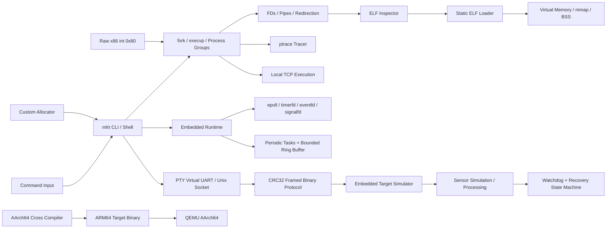

# Mini Linux Runtime & Execution Toolkit

A portfolio-grade **C/Linux systems project** that follows program execution from a typed command down through processes, file descriptors, ELF loading, virtual memory, tracing, and networking — then extends the same runtime into a **hardware-free embedded Linux simulation platform** with ARM64 cross compilation, QEMU, bounded queues, watchdog recovery, virtual serial transport, and a custom binary protocol.

The project started from systems-programming coursework and was reorganized into one integrated engineering system. Production modules no longer depend on the original course parser/startup helpers; the original coursework is preserved only under `legacy/` for provenance.

> **No physical hardware is required.** The embedded side is intentionally software-only and does not claim STM32, FreeRTOS, GPIO/SPI/I2C, DMA, JTAG, or board bring-up.

## System Architecture



## Execution Story

The repository is built around one continuous systems story:

```text
Command Input
   -> Shell Parsing
   -> Process Creation / Job Control
   -> File Descriptors / Pipes
   -> ELF Inspection
   -> Program Loading
   -> Virtual Memory
   -> Process Tracing
   -> Networking
   -> Embedded Runtime
   -> Virtual Serial / Binary Protocol
   -> ARM64 Target Simulation under QEMU
```

## Main Capabilities

### 1. Advanced Unix Shell

`mlrt shell` implements a Unix-style interactive shell with:

- `fork`, `execvp`, `waitpid`
- foreground/background jobs and `&`
- arbitrary N-stage pipelines with `|`
- `<`, `>`, and `>>` redirection
- `dup2` file-descriptor wiring
- process groups via `setpgid`
- terminal foreground control with `tcsetpgrp`
- `SIGINT`, `SIGTSTP`, `SIGCONT`
- `jobs`, `fg`, `bg`, `cd`, `history`, `help`, `exit`
- `!!` and `!n` history expansion
- periodic child reaping to avoid zombie accumulation
- single/double-quoted arguments and escape handling

```bash
./bin/mlrt shell
mlrt:/tmp$ printf 'alpha\nbeta\nalpha\n' | grep alpha | wc -l > count.txt
mlrt:/tmp$ sleep 30 &
mlrt:/tmp$ jobs
mlrt:/tmp$ fg %1
```

The same parser/execution engine is available noninteractively:

```bash
./bin/mlrt shell -c "printf hello | tr a-z A-Z"
```

### 2. ELF Inspector

`mlrt elf` is a simplified `readelf`-style inspector for ELF32/ELF64 little-endian images.

It reports:

- ELF magic, class, type, machine architecture
- executable entry point
- program headers and `PT_LOAD` segments
- section headers and names
- `.text`, `.data`, `.bss`, `.rodata`
- symbol tables, symbol type/binding/value/size
- file offsets and virtual addresses
- R/W/X permissions and alignment
- virtual-address-to-file-offset translation

```bash
./bin/mlrt elf /bin/ls --header --segments
./bin/mlrt elf ./bin/mlrt --sections --symbols
./bin/mlrt elf ./bin/mlrt --vaddr 0x1234
```

### 3. Memory Mapping Visualizer

`mlrt map` prints the memory plan implied by ELF `PT_LOAD` headers:

```text
SEGMENT VADDR              FILE OFF     FILESZ     MEMSZ      PERM  ZERO-FILL
LOAD    0x0000000000400000 0x0000000000 4096       4096       R--   0
LOAD    0x0000000000401000 0x0000001000 2048       4096       RW-   2048
```

```bash
./bin/mlrt map ./bin/mlrt
```

### 4. Static ELF Loader

The loader validates static `ET_EXEC` images and reproduces compatible `PT_LOAD` layouts in user space.

Implemented details include:

- ELF validation and architecture/class checks
- ELF32 and ELF64 program-header parsing
- page-aligned virtual addresses/file offsets
- `MAP_PRIVATE`
- `MAP_FIXED_NOREPLACE` by default
- optional `--force-fixed` educational mode
- ELF `PF_R/PF_W/PF_X` -> `PROT_READ/WRITE/EXEC`
- file-backed mappings
- `p_memsz > p_filesz` and BSS zero initialization
- final `mprotect` restoration
- rollback/cleanup with `munmap`
- deliberate rejection of dynamic `PT_INTERP` executables
- optional entry-point transfer for compatible freestanding static images

```bash
./bin/mlrt load ./some-static-program
./bin/mlrt load ./some-static-program --map
./bin/mlrt load ./some-static-program --execute
```

### 5. Process Tracer / Debugger

`mlrt trace` uses Linux `ptrace` for educational process inspection:

- launch a process under tracing
- attach to an existing PID when policy permits
- print x86-64 RIP/RSP/register state or i386 EIP/ESP state
- single-step instructions
- continue execution
- observe exec events, signals, and termination
- optionally read one machine word from tracee memory

```bash
./bin/mlrt trace run --steps 5 -- /bin/echo traced
./bin/mlrt trace attach 12345 --steps 1
```

### 6. Custom Memory Allocator

The allocator implements:

- `my_malloc` / `my_free`
- 16-byte alignment
- mmap-backed arenas
- address-ordered free list
- block splitting
- adjacent-block coalescing
- metadata validation
- allocator statistics
- mutex-protected shared state
- multithreaded stress testing

```bash
./bin/mlrt alloc-demo
```

### 7. Raw x86 Linux System Calls

The optional NASM layer demonstrates the 32-bit Linux `int 0x80` ABI directly.

It includes raw wrappers/examples for `open`, `read`, `write`, `close`, and `exit`, plus CDECL interoperability, syscall-number/argument registers, and raw negative errno return semantics.

```bash
make asm
./bin/raw-syscall-demo
```

### 8. Loopback TCP Command Server

The networking layer exposes the shell execution engine through a deliberately **loopback-only** TCP service.

- binds only to `127.0.0.1`
- length-prefixed framing
- stdout/stderr capture through pipes
- one thread per client
- child-process isolation for commands
- output cap and graceful disconnect handling
- exit-status response

```bash
# terminal 1
./bin/mlrt server --port 5050

# terminal 2
./bin/mlrt client --port 5050 -c "uname -s | tr a-z A-Z"
```

---

# Embedded Linux Simulation Layer — No Hardware

The second half of the project adds embedded-style software behavior without pretending that a physical MCU exists.

## 9. Periodic Runtime + Bounded Memory

`mlrt rt-demo` models a small data-acquisition pipeline:

```text
Periodic Sensor Task
       -> Fixed-Size Ring Buffer
       -> Processing Task
       -> Watchdog / Metrics
```

Implemented concepts:

- POSIX threads
- absolute `CLOCK_MONOTONIC` deadlines
- periodic task timing
- bounded fixed-size queue storage
- producer/consumer synchronization
- queue high-water tracking
- dropped-sample accounting
- timer jitter measurement
- deadline-miss counters
- watchdog heartbeat monitoring
- optional injected processing stalls

```bash
./bin/mlrt rt-demo --duration 2 --period-ms 10
./bin/mlrt rt-demo --duration 2 --period-ms 10 --inject-stall-ms 700
```

## 10. Embedded-Linux Event Loop

`mlrt event-demo` demonstrates descriptor-driven runtime design with `epoll`, `timerfd`, `eventfd`, and `signalfd`.

```bash
./bin/mlrt event-demo --ticks 10 --period-ms 100
```

## 11. Virtual UART with PTY

`mlrt serial-demo` creates a real Linux PTY master/slave pair using `posix_openpt` and uses it as a software serial line.

The host and virtual target exchange a framed packet over the byte stream:

```text
| MAGIC | VERSION | TYPE | LENGTH | SEQUENCE | PAYLOAD | CRC32 |
```

```bash
./bin/mlrt serial-demo
```

The frame parser validates magic, version, payload length, sequence number, and CRC32.

## 12. Persistent Embedded Target Simulator

Start the virtual device:

```bash
./bin/mlrt target-sim
```

From another terminal:

```bash
./bin/mlrt target status
./bin/mlrt target set-rate 50
./bin/mlrt target fw-info
./bin/mlrt target inject-fault freeze-worker
./bin/mlrt target inject-fault corrupt-crc
./bin/mlrt target reset
```

The target contains configurable periodic sensor generation, a bounded ring buffer, a processing worker, sample/drop/error counters, watchdog heartbeat detection, a target state machine, fault injection, and a persistent status/configuration service over a Unix-domain socket.

State flow:

```text
BOOT -> INIT -> READY -> RUNNING
                         |
                         v
                       FAULT
                         |
                         v
                      RECOVERY
                         |
                         +------> RUNNING
```

`freeze-worker` pauses the processing path long enough for the watchdog to detect a missed heartbeat and exercise the recovery state machine. `corrupt-crc` sends a deliberately corrupted frame so the target can exercise protocol-integrity error handling.

## 13. Firmware Image Simulator

The custom `MLFW` image format models firmware packaging/integrity concepts with a header containing magic, format version, target architecture, semantic firmware version, payload size, and CRC32.

```bash
./bin/mlrt fw pack app.bin firmware.img --version 1.2.3 --arch arm64
./bin/mlrt fw inspect firmware.img
./bin/mlrt fw verify firmware.img
./bin/mlrt fw check-update firmware.img --current 1.0.0
```

`check-update` validates image integrity and applies an anti-rollback semantic-version policy. Downgrades can only be permitted explicitly with `--allow-downgrade`.

This is an educational firmware container; it does **not** claim real MCU flash programming.

## 14. ARM64 Cross Compilation + QEMU

The embedded target side can be built as a real AArch64 Linux executable:

```bash
make arm64-target
```

Run its self-test under QEMU:

```bash
make qemu-smoke
```

Or:

```bash
./platform/arm64/run_target_qemu.sh --self-test
```

The ARM target reuses the same bounded-queue, protocol, watchdog, and target-state-machine code as the native target simulator.

## 15. Performance Measurements

`mlrt benchmark` provides simple measurements for monotonic timer jitter, Unix socket IPC, and bounded ring-buffer operations.

```bash
./bin/mlrt benchmark --iterations 1000 --timer-period-us 1000
```

These measurements are diagnostic/educational and are **not** hard real-time guarantees.

## Unified CLI

```text
Linux execution:
  mlrt shell
  mlrt elf FILE [...]
  mlrt map FILE
  mlrt load FILE [...]
  mlrt trace ...
  mlrt alloc-demo
  mlrt server [...]
  mlrt client [...]

Embedded simulation:
  mlrt rt-demo [...]
  mlrt event-demo [...]
  mlrt serial-demo
  mlrt target-sim [...]
  mlrt target status|set-rate|inject-fault|reset|fw-info [...]
  mlrt fw pack|inspect|verify|check-update ...
  mlrt benchmark [...]
```

## Repository Structure

```text
.
├── runtime/              # CLI dispatcher + structured logger
├── common/               # shared utility code
├── include/              # public project headers
├── shell/                # parser, pipelines, jobs, shell execution
├── elf/                  # ELF32/ELF64 parser + inspector
├── loader/               # static PT_LOAD mapper / entry-point loader
├── tracer/               # ptrace debugger/tracer
├── allocator/            # custom malloc/free implementation
├── asm/                  # raw 32-bit x86 int 0x80 examples
├── network/              # loopback TCP command execution
├── protocol/             # embedded framed protocol + CRC32
├── realtime/             # periodic runtime, event loop, bounded ring buffer
├── serial/               # PTY-backed virtual UART
├── target/               # embedded target simulator + host client
├── firmware/             # firmware image pack/inspect/verify/policy
├── benchmarks/           # timing/IPC/buffer measurements
├── platform/arm64/       # ARM64/QEMU helper scripts
├── tests/                # Linux + embedded automated tests
├── docs/                 # architecture, scope, execution model
├── legacy/               # original coursework migration/provenance
└── Makefile              # unified native/ARM/test build entry point
```

## Build

### Native Linux

```bash
make
./bin/mlrt help
```

### Run all native tests

```bash
make test
```

### ARM64 target

On Debian/Ubuntu:

```bash
sudo apt-get install gcc-aarch64-linux-gnu qemu-user
make arm64-target
make qemu-smoke
```

### Optional x86 NASM layer

```bash
make asm
```

## Automated Testing

The native test suite covers shell parsing, allocator correctness/concurrency, ELF parsing/address translation, static loader mapping, shell pipelines/redirection, local TCP client/server flow, CRC32 and packet framing, corrupted-frame rejection, bounded ring-buffer behavior, PTY virtual-UART exchange, periodic runtime execution, epoll/timerfd/eventfd/signalfd behavior, firmware pack/verify/anti-rollback policy, persistent target status/configuration, watchdog fault recovery, and a native target self-test.

GitHub Actions also has a separate ARM64 job that installs the AArch64 cross compiler and QEMU, cross-builds the target simulator, and runs its self-test under `qemu-aarch64`.

## Engineering Scope

This project intentionally demonstrates **user-space systems and embedded-Linux software engineering**.

It supports portfolio claims around C/Linux/POSIX, processes/signals/file descriptors/IPC, shell/job control, ELF/linker-loader concepts, virtual memory, `ptrace`, concurrency and synchronization, bounded buffers, event-driven Linux, binary protocol design, PTY serial simulation, watchdog/state-machine recovery, firmware-image integrity/version policy, ARM64 cross compilation, and QEMU target execution.

It does **not** claim hardware driver development, MCU peripheral programming, or physical firmware bring-up. See [`docs/limitations.md`](docs/limitations.md).

## Resume-Ready Description

**Mini Linux Runtime & Embedded Execution Toolkit — C, Linux, ARM64, ELF, QEMU**

- Built a modular Linux execution toolkit implementing a Unix-style shell with N-stage pipelines/job control, ELF32/ELF64 inspection, static program loading, virtual-memory mapping, `ptrace` tracing, custom allocation, raw x86 syscall examples, and local TCP execution.
- Extended it with a hardware-free embedded target simulator using periodic tasks, bounded ring buffers, watchdog recovery, Linux event APIs, PTY virtual serial transport, CRC32-framed messaging, firmware-image validation/anti-rollback logic, AArch64 cross compilation, and QEMU-based target testing.

## Documentation

- [`docs/architecture.md`](docs/architecture.md)
- [`docs/execution-model.md`](docs/execution-model.md)
- [`docs/embedded-simulation.md`](docs/embedded-simulation.md)
- [`docs/limitations.md`](docs/limitations.md)
- [`docs/portfolio-notes.md`](docs/portfolio-notes.md)

## Author

Mohamed Taha  
GitHub: https://github.com/mohamedtah22  
LinkedIn: https://linkedin.com/in/mohamed-taha-02314b314
