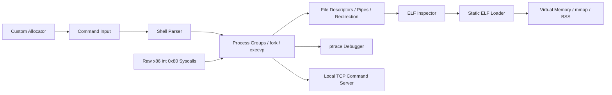

# Mini Linux Runtime & Execution Toolkit

A cohesive low-level Linux systems project written primarily in **C**, with a small **32-bit x86 NASM** layer. The toolkit follows a command from parsing and process creation through file descriptors, pipelines, ELF inspection, static program loading, virtual-memory mappings, process tracing, custom memory allocation, and local TCP command execution.

This repository started from systems-programming coursework and was reorganized and extended into a single engineering project. The production code no longer depends on the original course `LineParser` or startup helpers.

## Execution Pipeline



## What It Implements

### 1. Advanced Unix Shell

`mlrt shell` is an interactive Unix-style shell with:

- `fork`, `execvp`, `waitpid`
- foreground and background jobs with `&`
- arbitrary **N-stage pipelines** using `|`
- input redirection `<`
- output redirection `>` and append `>>`
- `dup2`-based file-descriptor wiring
- process groups with `setpgid`
- terminal foreground control with `tcsetpgrp`
- `SIGINT`, `SIGTSTP`, and `SIGCONT` behavior
- `jobs`, `fg`, `bg`, `cd`, `history`, `help`, `exit`
- `!!` and `!n` history expansion
- periodic `SIGCHLD` reaping to prevent zombie accumulation
- basic single/double-quoted arguments and escape handling

Example:

```bash
./bin/mlrt shell
mlrt:/tmp$ printf 'alpha\nbeta\nalpha\n' | grep alpha | wc -l > count.txt
mlrt:/tmp$ sleep 30 &
[1] 4128
mlrt:/tmp$ jobs
[1] Running  pgid=4128  sleep 30 &
mlrt:/tmp$ fg %1
```

Noninteractive execution uses the same parser/pipeline engine:

```bash
./bin/mlrt shell -c "printf hello | tr a-z A-Z"
# HELLO
```

### 2. ELF Inspector

`mlrt elf` is a simplified `readelf`-style inspector supporting **ELF32 and ELF64** little-endian images.

It reports:

- ELF magic and class
- machine architecture and object type
- executable entry point
- program headers and `PT_LOAD` segments
- section headers and names
- `.text`, `.data`, `.bss`, `.rodata` when present
- symbol tables, symbol type, binding, value, and size
- virtual addresses, file offsets, sizes, alignment, and R/W/X permissions
- virtual-address-to-file-offset translation

Examples:

```bash
./bin/mlrt elf /bin/ls --header --segments
./bin/mlrt elf ./bin/mlrt --sections --symbols
./bin/mlrt elf ./bin/mlrt --vaddr 0x1234
```

### 3. Memory Mapping Visualizer

`mlrt map` prints the file-backed and zero-filled memory plan implied by `PT_LOAD` headers:

```text
SEGMENT VADDR              FILE OFF     FILESZ     MEMSZ      PERM  ZERO-FILL
LOAD    0x0000000000400000 0x0000000000 4096       4096       R--   0
LOAD    0x0000000000401000 0x0000001000 2048       4096       RW-   2048
```

```bash
./bin/mlrt map ./bin/mlrt
```

### 4. Static ELF Loader

The loader validates a static `ET_EXEC` image, processes only `PT_LOAD` program headers, and reproduces its memory layout in the current process.

Implemented details:

- ELF validation and architecture/class checks
- `Elf32_Ehdr` / `Elf32_Phdr` support through the shared parser
- ELF64 support for native testing
- page-aligned virtual addresses and file offsets
- `MAP_PRIVATE`
- `MAP_FIXED_NOREPLACE` by default to avoid silently destroying existing mappings
- explicit `--force-fixed` mode for educational images that require `MAP_FIXED`
- ELF `PF_R/PF_W/PF_X` to `PROT_READ/PROT_WRITE/PROT_EXEC`
- file-backed segment mappings
- `p_memsz > p_filesz` handling
- zero initialization of partial-page and anonymous BSS tails
- `mprotect` restoration after BSS initialization
- mapping rollback and cleanup with `munmap`
- dynamic `PT_INTERP` executables rejected intentionally
- optional transfer of control to the ELF entry point

```bash
# Validate + visualize only
./bin/mlrt load ./some-static-program

# Actually map PT_LOAD segments, then clean them up
./bin/mlrt load ./some-static-program --map

# Execute a compatible freestanding static executable
./bin/mlrt load ./some-static-program --execute
```

The test suite builds a freestanding x86-64 ELF at a high virtual address and verifies that the custom loader can map it. Entry-point execution is also supported for compatible freestanding images. ELF32 i386 mapping is implemented, while entry-point execution of ELF32 requires a 32-bit build environment.

### 5. Process Debugger / Tracer

`mlrt trace` uses Linux `ptrace` for educational process inspection:

- launch a child under tracing
- attach to a PID when OS ptrace policy permits it
- display x86-64 `RIP/RSP/...` or i386 `EIP/ESP/...`
- single-step instructions
- continue execution
- observe exec events
- report signals and process termination
- optionally read one machine word from a requested tracee address

```bash
./bin/mlrt trace run --steps 5 -- /bin/echo traced
./bin/mlrt trace attach 12345 --steps 1
```

This module is intentionally limited to debugging/process-inspection behavior; it does not implement stealth, persistence, credential access, injection, or privilege bypass features.

### 6. Custom Memory Allocator

The allocator module implements:

- `my_malloc`
- `my_free`
- 16-byte alignment
- mmap-backed arenas
- address-ordered free list
- block splitting
- adjacent block coalescing
- allocation metadata with validation magic
- statistics for mapped/allocated/free memory
- a mutex protecting shared allocator state
- multithreaded stress tests

```bash
./bin/mlrt alloc-demo
```

### 7. Raw x86 Linux System Calls

The optional NASM module preserves the machine-level part of the original work and documents the 32-bit Linux `int 0x80` ABI.

`asm/syscalls32.asm` provides CDECL-callable wrappers for raw `open`, `read`, `write`, `close`, and `exit`. It documents `EAX` as the syscall-number/return register, syscall argument registers, and the fact that raw kernel failures are **negative errno values**, not necessarily `-1`.

```bash
make asm
./bin/raw-syscall-demo
```

### 8. Loopback TCP Command Server

The networking layer exposes the shell pipeline engine through a deliberately **loopback-only** TCP service.

- server binds to `127.0.0.1` only
- length-prefixed message framing
- command size limit
- stdout/stderr capture through pipes
- one thread per connected client
- command execution isolated in child processes
- mutex + condition variable for client lifecycle coordination
- graceful disconnect handling
- response includes exit status
- output capped at 1 MiB

```bash
# terminal 1
./bin/mlrt server --port 5050

# terminal 2
./bin/mlrt client --port 5050 -c "uname -s | tr a-z A-Z"
```

The server intentionally has no non-loopback binding option and no persistence or authentication-bypass behavior.

## Unified CLI

```text
./bin/mlrt help

mlrt shell
mlrt elf FILE [options]
mlrt map FILE
mlrt load FILE [--map|--execute] [--force-fixed]
mlrt trace run [--steps N] -- PROGRAM [ARGS...]
mlrt trace attach PID [--steps N]
mlrt alloc-demo
mlrt server [--port N] [--once]
mlrt client [--port N] [-c COMMAND]
```

## Repository Structure

```text
.
├── runtime/                # top-level mlrt CLI dispatcher
├── common/                 # shared utility code
├── include/                # public project headers
├── shell/                  # parser, pipelines, jobs, interactive shell
├── elf/                    # ELF32/ELF64 parser and inspector
├── loader/                 # static PT_LOAD mapper / entry-point loader
├── tracer/                 # ptrace debugger
├── allocator/              # custom malloc/free implementation
├── asm/                    # NASM int 0x80 syscall layer + legacy encoder
├── network/                # loopback TCP server/client + framing
├── tests/                  # parser, allocator, ELF, loader, network smoke tests
├── docs/                   # architecture and implementation notes
├── legacy/                 # migration notes from the original labs
└── Makefile                # unified build/test entry point
```

## Build

Requirements: Linux or WSL2, GCC, GNU Make, pthreads, and standard Linux development headers.

```bash
make
./bin/mlrt help
```

Feature-oriented targets:

```bash
make shell
make elf-inspector
make loader
make tracer
make allocator
make remote-shell
make test
make clean
```

Optional NASM target:

```bash
make asm
```

## Tests

`make test` covers shell parsing, quoted arguments, pipelines, redirection errors, allocator correctness and concurrent stress, ELF validation/address translation, mapping a purpose-built freestanding static ELF, shell execution, and loopback TCP request/response behavior.

The code was also exercised with AddressSanitizer + UndefinedBehaviorSanitizer during development.

## Design Notes

The toolkit is intentionally a **user-space systems project**. It demonstrates what happens around the Linux execution boundary without claiming kernel-driver or microcontroller functionality.

Key concepts:

`C` · `Linux` · `Processes` · `Process Groups` · `Signals` · `File Descriptors` · `Pipes` · `IPC` · `execvp` · `waitpid` · `ELF32` · `ELF64` · `Symbol Tables` · `Program Headers` · `mmap` · `Virtual Memory` · `BSS` · `R/W/X Permissions` · `ptrace` · `x86-64` · `x86 NASM` · `int 0x80` · `TCP/IP` · `Threads` · `Mutexes` · `Condition Variables` · `Memory Allocation`

## Limitations

- This is not a replacement for Bash, `readelf`, `ld-linux`, GDB, or glibc malloc.
- The parser implements a useful shell subset rather than the full POSIX grammar.
- The custom loader rejects dynamically linked `PT_INTERP` executables.
- Entry-point execution is intended for specially built freestanding static executables.
- ELF32 execution requires a 32-bit build environment, although ELF32 inspection/mapping logic is present.
- `ptrace attach` is subject to host kernel permissions.
- The TCP shell binds only to localhost by design.

See [`docs/limitations.md`](docs/limitations.md).

## Resume-Ready Description

**Mini Linux Runtime & Execution Toolkit — C, Linux, x86, ELF, Networking**  
Developed an integrated Linux systems toolkit spanning an N-stage Unix shell with process groups/job control, ELF32/ELF64 inspection, static `PT_LOAD` mapping with virtual-memory/BSS handling, `ptrace` process tracing, a custom mmap-backed allocator, raw x86 `int 0x80` system calls, and a concurrent loopback TCP command service. Added a unified CLI, build system, automated tests, error handling, and architecture documentation.

## Author

**Mohamed Taha**  
GitHub: https://github.com/mohamedtah22  
LinkedIn: https://linkedin.com/in/mohamed-taha-02314b314
