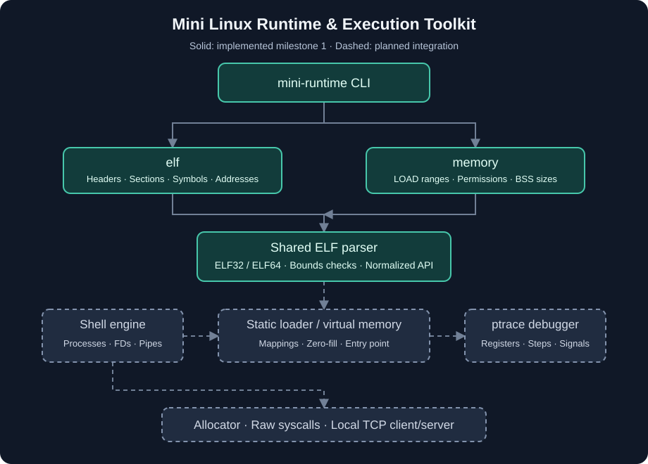

# Mini Linux Runtime & Execution Toolkit

A Linux systems toolkit in **C and x86 assembly**, exploring how commands become processes and how executable bytes become a virtual-memory image.

**Milestone 1 is implemented:** a shared, validated ELF parser, command-line inspector, and virtual-memory layout viewer. The original shell, assembly and loader sources are preserved while their integration proceeds in small, tested milestones.

## Architecture



The target execution path is:

**Command input → shell → processes → file descriptors/pipes → ELF inspection → loading → virtual memory → tracing → networking**

Inspection, loading and tracing are complementary entry points into that path, not compulsory steps executed by every shell command. Today, `mini-runtime elf` and `mini-runtime memory` share one parser and metadata model. The next loader will consume that same model.

## Working features

- ELF32/i386 and ELF64/x86-64 inspection, without requiring a 32-bit host or multilib.
- Header fields, architecture, entry point, program headers and section headers.
- Section names including `.text`, `.data`, `.bss` and `.rodata` when present.
- Static and dynamic symbol tables, symbol type, binding, visibility and section index.
- `PT_LOAD` ranges, file offsets, sizes, alignment, permissions and zero-fill sizes.
- Virtual-address translation that distinguishes file-backed bytes, BSS, unmapped addresses and overlapping segments.
- Bounds and overflow checks before metadata is consumed; explicit malformed-file diagnostics.
- Terminal-safe display of names embedded in ELF files.
- One top-level Makefile, reusable C parser API and automated regression tests.

## Build and try it

Requirements: Linux, a C11 compiler, GNU Make. Tests additionally need Python 3 and GNU `readelf` (binutils). The current milestone has no NASM or multilib dependency.

```sh
make
make elf-inspector
./build/mini-runtime --help
./build/mini-runtime elf --header ./build/mini-runtime
./build/mini-runtime elf --sections --symbols ./build/mini-runtime
./build/mini-runtime elf --segments /bin/ls
./build/mini-runtime memory /bin/ls
./build/elf-inspector --all /bin/ls
make test
make sanitize
make clean
```

To translate an address, take an entry point or `PT_LOAD` address from the inspector, then use:

```sh
./build/mini-runtime elf --vaddr 0x8048100 path/to/elf32
```

The address above belongs to the deterministic test fixture; real executable addresses differ. For PIE/shared objects, use ELF virtual addresses before the runtime load bias, not an ASLR-adjusted process address.

Example output from the ELF32 test fixture:

```text
ELF header
  Magic: 7f 45 4c 46
  Class: ELF32
  Encoding: little-endian
  Architecture: Intel 80386 (3)
  Type: 2
  Version: 1
  OS ABI: 0  ABI version: 0
  Entry: 0x8048100
```

Address translation examples from that fixture:

```text
0x8048100: file offset 0x100
0x8048180: zero-initialized memory (BSS); no file offset
0x8048200: not covered by a LOAD segment
```

The `memory` command prints a full table with `VADDR`, exclusive `END`, `OFFSET`, `FILESZ`, `MEMSZ`, `PERM`, `ALIGN` and `ZERO`. It describes ELF metadata; it does not map or execute a program.

## Repository structure

```text
cli/                        Top-level command dispatch and standalone inspector
elf/                        Shared parser API and presentation layer
tests/                      Synthetic ELF32/64 fixtures and regression tests
docs/                       Architecture, design, roadmap and portfolio notes
.github/workflows/ci.yml     Build, tests and sanitizer CI
Makefile                    Single build entry point for integrated modules
01-shell-basics/             Preserved original shell source
02-shell-pipelines-job-control/  Preserved extended shell and pipeline source
03-x86-assembly-syscalls/     Preserved NASM encoder and raw syscall source
04-elf-static-loader/        Preserved educational loader source
```

The numbered directories are migration inputs, not additional copies of the new modules. Their historical Makefiles require course support files absent from this repository (including `LineParser`, `looper` and loader startup support). They are excluded from the default build. Their original source functionality has not been removed or represented as newly verified.

## How execution and memory connect

A shell creates children with `fork`, connects file descriptors with `pipe`/`dup2`, and uses `execvp` to ask Linux to replace a process image. A future integrated shell will use process groups and terminal ownership to implement foreground/background job control. The existing shell sources provide the starting point; complete N-stage pipelines and POSIX-style job control are not claimed in this milestone.

ELF **sections** describe linker-facing organization; **program headers** describe the segments a loader needs. Segment R/W/X flags determine runtime permissions. Section A/W/X flags describe allocation, write and instruction properties and must not be mistaken for page permissions.

For an address within the file-backed portion of a `PT_LOAD` segment:

```text
file_offset = p_offset + (virtual_address - p_vaddr)
```

The interval `[p_vaddr + p_filesz, p_vaddr + p_memsz)` must be zero-initialized. It has no file bytes, even if unrelated data happens to exist at a numerically corresponding file offset. `SHT_NOBITS` sections likewise occupy no bytes in the file.

The next loader milestone will validate an ELF32 static executable, reserve its address ranges, map page-aligned segments privately, initialize BSS, apply final permissions and transfer control through a defined i386 startup contract. Parsing successfully is **not** proof an executable can safely be loaded: collision, overlap, interpreter, relocation, entry-point and stack requirements need separate loader checks. The existing course loader is not yet repaired or included in the new CLI.

Networking is planned after the shell engine is reusable. A loopback TCP server will pass framed commands through the same engine, capture output through pipes and return framed results to clients. There is no network listener or remote execution feature in this release.

## Testing

`make test` runs 22 automated test methods, including multiple fixtures and cases per method:

- Both ELF classes, headers, sections, symbol names/types/bindings and segment layouts.
- Translation at file/BSS/end boundaries and ambiguous overlapping `PT_LOAD` ranges.
- Sectionless binaries and `SHT_NOBITS` offsets outside the file.
- Invalid magic/class/architecture, sizes, indexes, strings, alignments and overflows.
- Missing files, invalid CLI arguments, truncated inputs and 80 deterministic mutations.
- Header values and LOAD counts compared against GNU `readelf` on the built executable.

`make sanitize` runs the same suite with AddressSanitizer and UndefinedBehaviorSanitizer. In restricted containers where LeakSanitizer cannot inspect `/proc`, use `ASAN_OPTIONS=detect_leaks=0 make sanitize`; this still checks memory access and undefined behavior but does **not** validate leaks. Local verification for this milestone used that setting because LeakSanitizer could not access process metadata. The CI configuration keeps normal leak detection enabled.

BSS tests validate layout and address semantics; actual zero-filled mappings and execution belong to the next milestone. There are no shell, allocator or networking integration tests yet.

## Limitations and next milestones

Only little-endian i386 and x86-64 are accepted. Extended ELF numbering and `SHN_XINDEX` are explicitly rejected. Inspection supports relocatable, executable, shared and core file types; it is not a relocation engine, disassembler, dynamic linker or DWARF debugger. Inputs are read into memory, so very large files require corresponding memory.

Implementation order and acceptance criteria are in [the roadmap](docs/roadmap.md):

1. **Complete:** ELF inspector, shared parser, CLI and memory layout view.
2. Robust static ELF32 loader and execution/BSS tests.
3. Reusable shell with N-stage pipelines, redirection, history and job control.
4. `ptrace` debugger with registers, stepping, continuation and exit handling.
5. Allocator with splitting, coalescing, synchronization, statistics and benchmark.
6. Local TCP command execution using the shell engine and framed client/server protocol.

Raw x86 syscall cleanup will accompany execution integration. Build targets such as `make loader`, `make shell` and `make remote-shell` will be added with their working implementations, not as placeholders.

## Resume-ready description

**Mini Linux Runtime & Execution Toolkit — C, Linux, ELF, x86**

Implemented a reusable ELF32/ELF64 parser and Linux CLI for inspecting executable headers, sections, symbols and memory segments; added virtual-address translation with explicit BSS handling, malformed-input validation, and regression tests against GNU readelf.

See [portfolio notes](docs/portfolio-notes.md) for an honest distinction between implemented capabilities and future work. This repository does not claim kernel development, device drivers, STM32, FreeRTOS, JTAG, SPI, I2C or UART work.

## Author

**Mohamed Taha** · [GitHub](https://github.com/mohamedtah22) · [LinkedIn](https://linkedin.com/in/mohamed-taha-02314b314)
