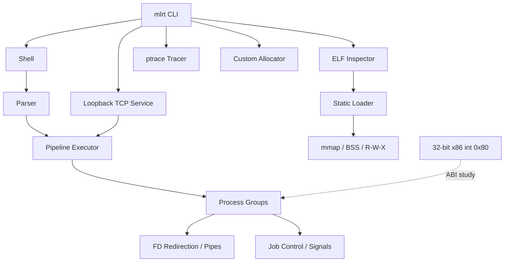

# Architecture

The project is organized around one question: **what happens between a command string and running machine code on Linux?**

## Module boundaries

- **shell/parser.c** has no process-management state; it only turns text into a structured N-stage pipeline.
- **shell/shell.c** owns execution semantics: `fork`, `execvp`, pipes, redirection, process groups, terminal control, and built-ins.
- **shell/jobs.c** tracks background/stopped process groups and reaps child state changes.
- **elf/elf_parser.c** is reusable ELF32/ELF64 parsing logic used by the inspector, map visualizer, tests, and loader.
- **loader/loader.c** translates `PT_LOAD` metadata into actual virtual-memory mappings.
- **tracer/tracer.c** is independent of the shell and works directly through `ptrace`.
- **allocator/allocator.c** is an mmap-backed allocator with a mutex-protected global free list.
- **network/server.c** reuses the shell's noninteractive pipeline executor rather than calling `/bin/sh -c`.

## Execution path

For `cat input | grep token > output`:

1. The parser creates two `ShellCommand` structures.
2. The executor creates one pipe.
3. Both child processes are placed in the same process group.
4. Child 1 duplicates the pipe write end onto stdout.
5. Child 2 duplicates the pipe read end onto stdin and opens `output` for stdout.
6. Unused descriptors are closed in every process.
7. Children call `execvp`.
8. The shell either gives the terminal to the foreground process group and waits, or records a background job.
9. Later `SIGCHLD` events are reaped through `waitpid`.

## ELF path

1. `elf_image_open` validates the ELF magic/class/endianness and bounds-checks tables.
2. The inspector walks section/program headers and symbol/string tables.
3. The map visualizer filters `PT_LOAD` entries and displays file-vs-memory size.
4. The loader aligns `p_vaddr` and `p_offset` to pages.
5. File-backed bytes are mapped `MAP_PRIVATE` with translated R/W/X permissions.
6. `p_memsz - p_filesz` is zero-filled, including partial-page BSS and anonymous tail pages.
7. Optional entry-point execution transfers control to a compatible freestanding static image.
