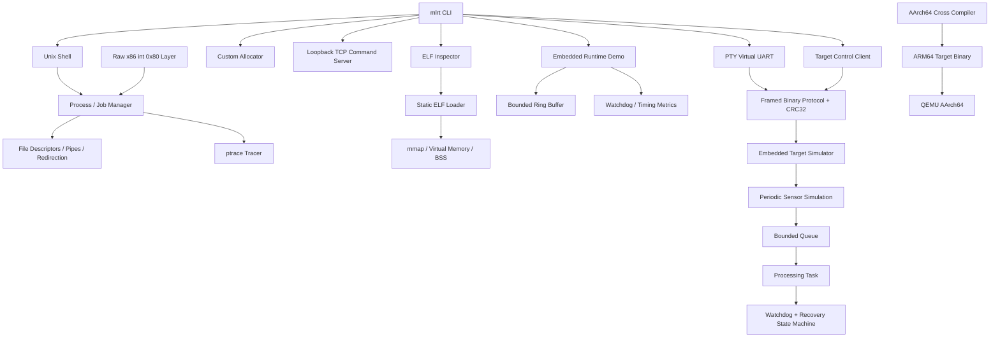

# Architecture

The repository is organized as one execution/runtime system rather than independent lab exercises.

## Design Boundaries

- `shell/`, `elf/`, `loader/`, `tracer/`, `allocator/`, and `network/` cover the Linux execution path.
- `protocol/`, `realtime/`, `serial/`, `target/`, and `firmware/` add embedded-style runtime behavior without physical hardware.
- `platform/arm64/` demonstrates cross-target builds and QEMU execution.
- `legacy/` preserves the original coursework only for provenance; production modules do not depend on course parser/startup helpers.
- `tests/` validates both the Linux path and the embedded simulation path.
