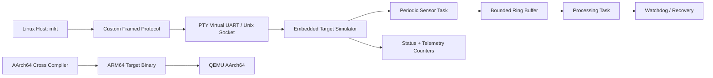

# Embedded Linux Simulation Layer (No Hardware Required)

The embedded extension turns the Mini Linux Runtime into a two-sided software system: a Linux host toolkit and a virtual embedded target. It deliberately avoids claiming MCU peripherals or physical board bring-up; every hardware-like transport is simulated in user space.

## System Model



## What Is Real vs Simulated

Real Linux mechanisms used by the project:

- POSIX threads and synchronization
- `clock_nanosleep` / monotonic clocks
- bounded fixed-size queues
- PTYs (`posix_openpt`) as a serial-style transport
- Unix-domain sockets for host/target control
- binary framing, sequence numbers, CRC32, partial-read handling
- AArch64 cross compilation
- QEMU user-mode execution of the ARM64 target binary
- watchdog timing and state-machine recovery logic

Simulated elements:

- sensor samples are generated by software
- the serial line is a PTY rather than a physical UART
- the target is a Linux process / ARM64 process under QEMU rather than a microcontroller
- firmware images are a custom educational format, not vendor-specific MCU flash images

Not implemented or claimed: STM32, GPIO, SPI, I2C, DMA, JTAG, FreeRTOS, device-driver bring-up, or physical hardware validation.

## Embedded Runtime Demo

`mlrt rt-demo` runs a periodic producer, a bounded ring buffer, a processing worker, and a watchdog. The producer uses absolute monotonic deadlines and records jitter, queue depth, dropped samples, and missed deadlines.

```bash
./bin/mlrt rt-demo --duration 2 --period-ms 10
./bin/mlrt rt-demo --duration 2 --period-ms 10 --inject-stall-ms 700
```

The stall option intentionally pauses the processing worker so the watchdog path can be observed.

## Virtual UART

`mlrt serial-demo` creates a PTY master/slave pair and exchanges a real binary frame through it:

```text
MAGIC | VERSION | TYPE | LENGTH | SEQUENCE | PAYLOAD | CRC32
```

The host sends a `STATUS_REQ`, the virtual target validates framing/CRC and returns a `STATUS_RSP`.

```bash
./bin/mlrt serial-demo
```

## Persistent Target Simulator

Start the target:

```bash
./bin/mlrt target-sim
```

Control it from another terminal:

```bash
./bin/mlrt target status
./bin/mlrt target set-rate 50
./bin/mlrt target fw-info
./bin/mlrt target inject-fault freeze-worker
sleep 1.2
./bin/mlrt target status
./bin/mlrt target reset
```

The target state machine moves through:

```text
BOOT -> INIT -> READY -> RUNNING -> FAULT -> RECOVERY -> RUNNING
```

A frozen processing task stops its heartbeat. The watchdog detects the missed heartbeat, records a recovery, enters `FAULT`, then `RECOVERY`, and returns to `RUNNING`.

## Firmware Image Simulator

The project includes a small firmware-container format for practicing image metadata and integrity validation:

```text
MLFW header
  format version
  target architecture
  semantic version
  payload size
  CRC32
payload
```

```bash
./bin/mlrt fw pack app.bin firmware.img --version 1.2.3 --arch arm64
./bin/mlrt fw inspect firmware.img
./bin/mlrt fw verify firmware.img
```

This models firmware packaging and validation concepts without pretending to program real flash memory.

## ARM64 + QEMU

Cross compile only the target side:

```bash
make arm64-target
```

Run its self-test under QEMU:

```bash
make qemu-smoke
```

Or launch the ARM target directly through the helper:

```bash
./platform/arm64/run_target_qemu.sh --self-test
```

The GitHub Actions workflow installs the AArch64 cross compiler and QEMU, builds the ARM target, and executes its self-test.
